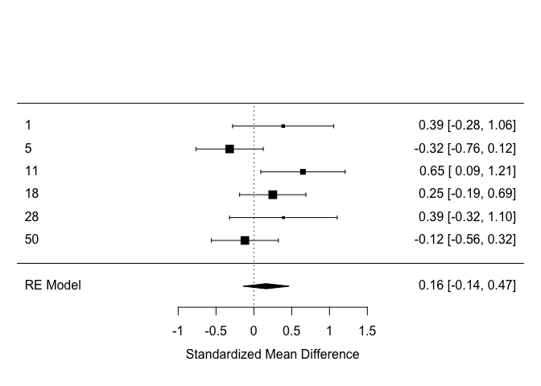

Building on the shoulders of giants: meta-analysis
==================================================

Questions to be answered
------------------------

1.  What is the current evidence for distinctive vocal patterns in schizophrenia? Report how many papers report quantitative estimates, comment on what percentage of the overall studies reviewed they represent (see PRISMA chart) your method to analyze them, the estimated effect size of the difference (mean effect size and standard error) and forest plots representing it. N.B. Only measures of pitch mean and pitch sd are required for the assignment. Feel free to ignore the rest (although pause behavior looks interesting, if you check my article).

2.  Do the results match your own analysis from Assignment 3? If you add your results to the meta-analysis, do the estimated effect sizes change? Report the new estimates and the new forest plots.

3.  Assess the quality of the literature: report and comment on heterogeneity of the studies (tau, I2), on publication bias (funnel plot), and on influential studies.

``` r
library(tidyverse, lme4)
```

    ## ── Attaching packages ──────────────────────────────────────────────────────────────────────────────────────────────────────── tidyverse 1.2.1 ──

    ## ✔ ggplot2 3.2.1     ✔ purrr   0.3.2
    ## ✔ tibble  2.1.3     ✔ dplyr   0.8.3
    ## ✔ tidyr   0.8.3     ✔ stringr 1.4.0
    ## ✔ readr   1.3.1     ✔ forcats 0.4.0

    ## ── Conflicts ─────────────────────────────────────────────────────────────────────────────────────────────────────────── tidyverse_conflicts() ──
    ## ✖ dplyr::filter() masks stats::filter()
    ## ✖ dplyr::lag()    masks stats::lag()

``` r
pacman::p_load(lmerTest, simr, DescTools, goeveg, sjstats, effsize, ggplot2, dplyr, groupdata2, stringr, caret, tidyr, metafor, reshape2)

data <- readxl::read_xlsx("Matrix_MetaAnalysis_Diagnosis_updated290719.xlsx")
```

    ## New names:
    ## * frequency -> frequency...68
    ## * frequency -> frequency...73
    ## * frequency -> frequency...78
    ## * frequency -> frequency...83
    ## * frequency -> frequency...88
    ## * … and 7 more problems

``` r
##### IDENTIFY COLUMNS WE WANT #####

#head(data)
#sample size of groups
#data$SAMPLE_SIZE_SZ
#data$SAMPLE_SIZE_HC
#Mean within participant
#one <- as.data.frame(data$PITCH_F0_SZ_M)
#two <- as.data.frame(data$PITCH_F0_HC_M)
#data$PITCH_F0_SZ_SD
#data$PITCH_F0_HC_SD
#SD within participant
#data$PITCH_F0SD_SZ_M
#data$PITCH_F0SD_HC_M
#data$PITCH_F0SD_SZ_SD
#data$PITCH_F0SD_HC_SD

#each study has one row 
#different amount of studies have reported mean and sd, but we don't need only studies that have both 

##### CALCULATE SMD AND VARIANCE #####
mean <- escalc(measure = "SMD", n1i = data$SAMPLE_SIZE_SZ, n2i = data$SAMPLE_SIZE_HC, m1i = data$PITCH_F0_SZ_M, m2i = data$PITCH_F0_HC_M, sd1i = data$PITCH_F0_SZ_SD, sd2i = data$PITCH_F0_HC_SD) 
#SMD: standardized mean difference, method we use 
#n1i: sample size of SZ in each study
#n2i: sample size of HC in each study
#m1i: mean pitch of SZ in each study
#m2i: mean pitch of HC in each study
#sd1i: variability of pitch of SZ in each study 
#sd2i: variability of pitch of HC in each study 
#result: 
  #y(i): standardized mean difference between mean in pitch in SZC and HC in each study, effect size
  #v(i): variance of that measure (sd2), not se

sd <- escalc(measure = "SMD", n1i = data$SAMPLE_SIZE_SZ, n2i = data$SAMPLE_SIZE_HC, m1i = data$PITCH_F0SD_SZ_M, m2i = data$PITCH_F0SD_HC_M, sd1i = data$PITCH_F0SD_SZ_SD, sd2i = data$PITCH_F0SD_HC_SD)
#SMD: standardized mean difference, method we use 
#n1i: sample size of SZ in each study
#n2i: sample size of HC in each study
#m1i: variance in pitch SZ in each study
#m2i: variance in pitch of HC in each study
#sd1i: variance in the variance in pitch of SZ in each study 
#sd2i: variance in the variance in pitch of HC in each study 
#result: 
  #y(i): standardized mean difference between mean in pitch in SZC and HC in each study, effect size
  #v(i): measure of variance (sd2), not se


##### MERGE #####
#how do we calculate the effect size for the meta anylsis? #merge the two data frame 
data <- data %>%
  mutate(es_mean = mean$yi, var_mean = mean$vi, es_sd = sd$yi, var_sd = sd$vi)

##### MODELS #####
#calculating an overall effect size, while punishing studies with a bigger variance (weights) and adding a random effect for the studies (they might differ in their effect)
estimate_mean <- lmer(es_mean ~ 1 + (1|StudyID), weights = 1/var_mean, data = data, 
                      control = lmerControl(check.nobs.vs.nlev="ignore",
                                            check.nobs.vs.nRE="ignore"), REML =F)
summary(estimate_mean)
```

    ## Linear mixed model fit by maximum likelihood . t-tests use
    ##   Satterthwaite's method [lmerModLmerTest]
    ## Formula: es_mean ~ 1 + (1 | StudyID)
    ##    Data: data
    ## Weights: 1/var_mean
    ## Control: 
    ## lmerControl(check.nobs.vs.nlev = "ignore", check.nobs.vs.nRE = "ignore")
    ## 
    ##      AIC      BIC   logLik deviance df.resid 
    ##      9.7      9.0     -1.8      3.7        3 
    ## 
    ## Scaled residuals: 
    ##       Min        1Q    Median        3Q       Max 
    ## -0.006661 -0.002930  0.001998  0.003651  0.007026 
    ## 
    ## Random effects:
    ##  Groups   Name        Variance  Std.Dev.
    ##  StudyID  (Intercept) 0.1078829 0.328455
    ##  Residual             0.0000362 0.006017
    ## Number of obs: 6, groups:  StudyID, 6
    ## 
    ## Fixed effects:
    ##             Estimate Std. Error     df t value Pr(>|t|)
    ## (Intercept)   0.2065     0.1341 6.0000    1.54    0.174

``` r
#calculating an overall effect size of the variability/sd, while punishing studies with a bigger variance (weights) and adding a random effect for the studies (they might differ in their effect)
estimate_sd <- lmer(es_sd ~ 1 + (1|StudyID), weights = 1/var_sd, data = data, 
                    control = lmerControl(check.nobs.vs.nlev="ignore",
                                            check.nobs.vs.nRE="ignore"), REML = F)
```

    ## boundary (singular) fit: see ?isSingular

``` r
summary(estimate_sd)
```

    ## Linear mixed model fit by maximum likelihood . t-tests use
    ##   Satterthwaite's method [lmerModLmerTest]
    ## Formula: es_sd ~ 1 + (1 | StudyID)
    ##    Data: data
    ## Weights: 1/var_sd
    ## Control: 
    ## lmerControl(check.nobs.vs.nlev = "ignore", check.nobs.vs.nRE = "ignore")
    ## 
    ##      AIC      BIC   logLik deviance df.resid 
    ##     44.8     46.9    -19.4     38.8       12 
    ## 
    ## Scaled residuals: 
    ##      Min       1Q   Median       3Q      Max 
    ## -1.35018 -0.53708 -0.09548  0.35894  3.02323 
    ## 
    ## Random effects:
    ##  Groups   Name        Variance Std.Dev.
    ##  StudyID  (Intercept)  0.00    0.000   
    ##  Residual             11.01    3.318   
    ## Number of obs: 15, groups:  StudyID, 12
    ## 
    ## Fixed effects:
    ##             Estimate Std. Error      df t value Pr(>|t|)
    ## (Intercept)  -0.2333     0.2115 15.0000  -1.103    0.287
    ## convergence code: 0
    ## boundary (singular) fit: see ?isSingular

``` r
#alternative way of creating models
estimate_mean1 <- rma(es_mean, var_mean, data = data, slab=StudyID)
```

    ## Warning in rma(es_mean, var_mean, data = data, slab = StudyID): Studies
    ## with NAs omitted from model fitting.

``` r
estimate_sd1 <- rma(es_sd, var_sd, data = data, slab=StudyID)
```

    ## Warning in rma(es_sd, var_sd, data = data, slab = StudyID): Studies with
    ## NAs omitted from model fitting.

``` r
#### PLOTS ####
#for mean 
forest(estimate_mean1)
```



``` r
funnel(estimate_mean1)
```


``` r
#standardised mean differences; smaller sample the bigger standard error; bigger sample, smaller effect size 
regtest(estimate_mean1) #regtast same ans ranktest but takes into account that the effects might not be linear
```

    ## 
    ## Regression Test for Funnel Plot Asymmetry
    ## 
    ## model:     mixed-effects meta-regression model
    ## predictor: standard error
    ## 
    ## test for funnel plot asymmetry: z = 1.5798, p = 0.1142

``` r
ranktest(estimate_mean1) 
```

    ## 
    ## Rank Correlation Test for Funnel Plot Asymmetry
    ## 
    ## Kendall's tau = 0.2000, p = 0.7194

``` r
infmean <- influence(estimate_mean1) #influential data points
print(infmean) #study 11 influential
```

    ## 
    ##    rstudent  dffits cook.d  cov.r tau2.del QE.del    hat  weight    dfbs 
    ## 1    0.5262  0.1826 0.0361 1.2793   0.0866 9.1799 0.1286 12.8591  0.1803 
    ## 5   -1.8551 -0.8370 0.4538 0.8656   0.0280 4.9417 0.1969 19.6867 -0.8137 
    ## 11   1.6002  0.7739 0.4550 0.8674   0.0346 5.8661 0.1586 15.8640  0.7871 
    ## 18   0.2243  0.0623 0.0050 1.5403   0.1052 9.4274 0.1992 19.9247  0.0632 
    ## 28   0.5115  0.1697 0.0309 1.2612   0.0860 9.2530 0.1190 11.9019  0.1672 
    ## 50  -0.8629 -0.4438 0.2178 1.3578   0.0841 8.3757 0.1976 19.7636 -0.4464 
    ##    inf 
    ## 1 
    ## 5 
    ## 11   * 
    ## 18 
    ## 28 
    ## 50

``` r
plot(infmean)
```


``` r
#for pitch sd
forest(estimate_sd1)
```


``` r
funnel(estimate_sd1)
```


``` r
regtest(estimate_sd1)
```

    ## 
    ## Regression Test for Funnel Plot Asymmetry
    ## 
    ## model:     mixed-effects meta-regression model
    ## predictor: standard error
    ## 
    ## test for funnel plot asymmetry: z = 0.2515, p = 0.8014

``` r
ranktest(estimate_sd1)
```

    ## 
    ## Rank Correlation Test for Funnel Plot Asymmetry
    ## 
    ## Kendall's tau = -0.2762, p = 0.1686

``` r
infsd <- influence(estimate_sd1)
print(infsd) #study 15 influential
```

    ## 
    ##      rstudent  dffits cook.d  cov.r tau2.del   QE.del    hat weight 
    ## 5      0.0149  0.0033 0.0000 1.1628   1.3031 165.0981 0.0681 6.8120 
    ## 6      0.3912  0.1012 0.0109 1.1369   1.2794 163.7776 0.0630 6.2964 
    ## 8     -0.0719 -0.0199 0.0004 1.1584   1.3002 164.9937 0.0665 6.6468 
    ## 9.1   -0.1232 -0.0336 0.0012 1.1585   1.2997 164.7844 0.0669 6.6889 
    ## 14    -0.2650 -0.0717 0.0055 1.1537   1.2938 163.6838 0.0670 6.7043 
    ## 15     5.6462  1.3862 0.6131 0.3109   0.2969  61.1099 0.0643 6.4328 
    ## 22    -0.5929 -0.1589 0.0266 1.1272   1.2628 158.9801 0.0667 6.6686 
    ## 42.1   0.1693  0.0455 0.0023 1.1639   1.3021 163.1599 0.0698 6.9831 
    ## 42.2   0.0901  0.0238 0.0006 1.1646   1.3037 164.7881 0.0692 6.9241 
    ## 46    -1.5066 -0.3906 0.1404 0.9785   1.0900 145.1838 0.0638 6.3755 
    ## 47.1  -1.2786 -0.3386 0.1096 1.0222   1.1392 144.1403 0.0658 6.5793 
    ## 47.2  -0.7259 -0.1939 0.0390 1.1113   1.2442 156.6876 0.0664 6.6398 
    ## 48.1   0.3912  0.1044 0.0116 1.1460   1.2844 162.2075 0.0672 6.7205 
    ## 48.2   0.4107  0.1096 0.0128 1.1445   1.2827 161.9134 0.0672 6.7202 
    ## 50    -0.1675 -0.0459 0.0023 1.1600   1.2999 164.2886 0.0681 6.8075 
    ##         dfbs inf 
    ## 5     0.0033     
    ## 6     0.1010     
    ## 8    -0.0199     
    ## 9.1  -0.0336     
    ## 14   -0.0717     
    ## 15    1.4477   * 
    ## 22   -0.1589     
    ## 42.1  0.0456     
    ## 42.2  0.0238     
    ## 46   -0.3914     
    ## 47.1 -0.3387     
    ## 47.2 -0.1939     
    ## 48.1  0.1044     
    ## 48.2  0.1096     
    ## 50   -0.0459

``` r
plot(infsd)
```


``` r
#standardised mean differences for variability

### ADD OWN STUDY
#just notes (can ignore)
#yi: if pitchmean ~ diagnosis + ..., if pitch mnean scaled, the beta for diagnosis is yi 
#vi: sd2, two options: (1) beta comes with se, and take se as sd, cheating, because divided by n, but n is fractional, nobody knows what it means, (2) sd is average errror in prediction, lmer will give average residual = error, so the average residual is the sd - square it and get vi 
#what if 1 for each study, probably have (1+Diagnosis|Study), tells you how each study is deviating from main (diagnosis beta), so you have beta and 7 values for each study (extract by RANEF(MODEL)) if take that value and add to beta, than you get if for each study seperately. 

############# PART 2: ADDING OUR STUDY ###################

#load data
danish <- read.csv("danishdata.csv")
data <- readxl::read_xlsx("Matrix_MetaAnalysis_Diagnosis_updated290719.xlsx")
```

    ## New names:
    ## * frequency -> frequency...68
    ## * frequency -> frequency...73
    ## * frequency -> frequency...78
    ## * frequency -> frequency...83
    ## * frequency -> frequency...88
    ## * … and 7 more problems

``` r
#summarise to calculate mean and sd
sum <- danish %>% group_by(Diagnosis) %>% 
  summarise("SampleSize" = nlevels(as.factor(uID)),
            "MeanofMean" = mean(mean),
            "SDofMean" = sd(mean), 
            "MeanofSD" = mean(sd), 
            "SDofSD" = sd(sd))

#create row
new <- data.frame("StudyID" = 60, 
                  "SAMPLE_SIZE_SZ" = sum$SampleSize[sum$Diagnosis == 1], 
                  "SAMPLE_SIZE_HC" = sum$SampleSize[sum$Diagnosis == 0],
                  "PITCH_F0_SZ_M" = sum$MeanofMean[sum$Diagnosis == 1],
                  "PITCH_F0_HC_M" = sum$MeanofMean[sum$Diagnosis == 0],
                  "PITCH_F0_SZ_SD" = sum$SDofMean[sum$Diagnosis == 1], 
                  "PITCH_F0_HC_SD" = sum$SDofMean[sum$Diagnosis == 0],
                  "PITCH_F0SD_SZ_M" = sum$MeanofSD[sum$Diagnosis == 1],
                  "PITCH_F0SD_HC_M" = sum$MeanofSD[sum$Diagnosis == 0],
                  "PITCH_F0SD_SZ_SD" = sum$SDofSD[sum$Diagnosis == 1], 
                  "PITCH_F0SD_HC_SD" = sum$SDofSD[sum$Diagnosis == 0])

#add row
data <- bind_rows(data, new)

#escalc to get SMD (effect size) and variance (sd2)
mean <- escalc(measure = "SMD", n1i = data$SAMPLE_SIZE_SZ, n2i = data$SAMPLE_SIZE_HC, m1i = data$PITCH_F0_SZ_M, m2i = data$PITCH_F0_HC_M, sd1i = data$PITCH_F0_SZ_SD, sd2i = data$PITCH_F0_HC_SD) 
sd <- escalc(measure = "SMD", n1i = data$SAMPLE_SIZE_SZ, n2i = data$SAMPLE_SIZE_HC, m1i = data$PITCH_F0SD_SZ_M, m2i = data$PITCH_F0SD_HC_M, sd1i = data$PITCH_F0SD_SZ_SD, sd2i = data$PITCH_F0SD_HC_SD)

#mutate
data <- data %>%
  mutate(es_mean = mean$yi, var_mean = mean$vi, es_sd = sd$yi, var_sd = sd$vi)

##### MODELS #####
model_mean_new <- lmer(es_mean ~ 1 + (1 | StudyID), data = data, weights = 1/var_mean, REML = F, control = lmerControl(
    check.nobs.vs.nlev = "ignore",
    check.nobs.vs.nRE = "ignore"
))
```

    ## Warning in checkConv(attr(opt, "derivs"), opt$par, ctrl =
    ## control$checkConv, : Hessian is numerically singular: parameters are not
    ## uniquely determined

``` r
summary(model_mean_new)
```

    ## Linear mixed model fit by maximum likelihood . t-tests use
    ##   Satterthwaite's method [lmerModLmerTest]
    ## Formula: es_mean ~ 1 + (1 | StudyID)
    ##    Data: data
    ## Weights: 1/var_mean
    ## Control: 
    ## lmerControl(check.nobs.vs.nlev = "ignore", check.nobs.vs.nRE = "ignore")
    ## 
    ##      AIC      BIC   logLik deviance df.resid 
    ##     10.1      9.9     -2.0      4.1        4 
    ## 
    ## Scaled residuals: 
    ##       Min        1Q    Median        3Q       Max 
    ## -0.011124 -0.005087  0.002031  0.008183  0.014160 
    ## 
    ## Random effects:
    ##  Groups   Name        Variance  Std.Dev.
    ##  StudyID  (Intercept) 0.1048571 0.32382 
    ##  Residual             0.0001143 0.01069 
    ## Number of obs: 7, groups:  StudyID, 7
    ## 
    ## Fixed effects:
    ##             Estimate Std. Error     df t value Pr(>|t|)
    ## (Intercept)   0.1610     0.1224 7.0000   1.316     0.23
    ## convergence code: 0
    ##  Hessian is numerically singular: parameters are not uniquely determined

``` r
model_sd_new <- lmer(es_sd ~ 1 + (1 | StudyID), data = data, weights = 1/var_sd, REML = F, control = lmerControl(
    check.nobs.vs.nlev = "ignore",
    check.nobs.vs.nRE = "ignore"
))
```

    ## boundary (singular) fit: see ?isSingular

``` r
summary(model_sd_new)
```

    ## Linear mixed model fit by maximum likelihood . t-tests use
    ##   Satterthwaite's method [lmerModLmerTest]
    ## Formula: es_sd ~ 1 + (1 | StudyID)
    ##    Data: data
    ## Weights: 1/var_sd
    ## Control: 
    ## lmerControl(check.nobs.vs.nlev = "ignore", check.nobs.vs.nRE = "ignore")
    ## 
    ##      AIC      BIC   logLik deviance df.resid 
    ##     45.0     47.3    -19.5     39.0       13 
    ## 
    ## Scaled residuals: 
    ##      Min       1Q   Median       3Q      Max 
    ## -1.38511 -0.44684 -0.09025  0.37185  3.12916 
    ## 
    ## Random effects:
    ##  Groups   Name        Variance Std.Dev.
    ##  StudyID  (Intercept)  0.00    0.000   
    ##  Residual             10.33    3.213   
    ## Number of obs: 16, groups:  StudyID, 13
    ## 
    ## Fixed effects:
    ##             Estimate Std. Error      df t value Pr(>|t|)
    ## (Intercept)  -0.2421     0.1853 16.0000  -1.306     0.21
    ## convergence code: 0
    ## boundary (singular) fit: see ?isSingular

``` r
model_mean_new1 <- rma(yi = es_mean, vi = var_mean, data = data, slab = StudyID)
```

    ## Warning in rma(yi = es_mean, vi = var_mean, data = data, slab = StudyID):
    ## Studies with NAs omitted from model fitting.

``` r
summary(model_mean_new1)
```

    ## 
    ## Random-Effects Model (k = 7; tau^2 estimator: REML)
    ## 
    ##   logLik  deviance       AIC       BIC      AICc 
    ##  -2.2403    4.4805    8.4805    8.0640   12.4805   
    ## 
    ## tau^2 (estimated amount of total heterogeneity): 0.0560 (SE = 0.0660)
    ## tau (square root of estimated tau^2 value):      0.2367
    ## I^2 (total heterogeneity / total variability):   50.95%
    ## H^2 (total variability / sampling variability):  2.04
    ## 
    ## Test for Heterogeneity:
    ## Q(df = 6) = 11.7069, p-val = 0.0688
    ## 
    ## Model Results:
    ## 
    ## estimate      se    zval    pval    ci.lb   ci.ub 
    ##   0.0973  0.1291  0.7536  0.4511  -0.1558  0.3504    
    ## 
    ## ---
    ## Signif. codes:  0 '***' 0.001 '**' 0.01 '*' 0.05 '.' 0.1 ' ' 1

``` r
confint(model_mean_new1)
```

    ## 
    ##        estimate  ci.lb   ci.ub 
    ## tau^2    0.0560 0.0000  0.5258 
    ## tau      0.2367 0.0000  0.7251 
    ## I^2(%)  50.9544 0.0000 90.6976 
    ## H^2      2.0389 1.0000 10.7499

``` r
model_sd_new1 <- rma(yi = es_sd, vi = var_sd, data = data, slab = StudyID)
```

    ## Warning in rma(yi = es_sd, vi = var_sd, data = data, slab = StudyID):
    ## Studies with NAs omitted from model fitting.

``` r
summary(model_sd_new1)
```

    ## 
    ## Random-Effects Model (k = 16; tau^2 estimator: REML)
    ## 
    ##   logLik  deviance       AIC       BIC      AICc 
    ## -22.7874   45.5748   49.5748   50.9909   50.5748   
    ## 
    ## tau^2 (estimated amount of total heterogeneity): 1.1018 (SE = 0.4293)
    ## tau (square root of estimated tau^2 value):      1.0497
    ## I^2 (total heterogeneity / total variability):   95.23%
    ## H^2 (total variability / sampling variability):  20.96
    ## 
    ## Test for Heterogeneity:
    ## Q(df = 15) = 165.2049, p-val < .0001
    ## 
    ## Model Results:
    ## 
    ## estimate      se     zval    pval    ci.lb   ci.ub 
    ##  -0.2453  0.2711  -0.9049  0.3655  -0.7767  0.2861    
    ## 
    ## ---
    ## Signif. codes:  0 '***' 0.001 '**' 0.01 '*' 0.05 '.' 0.1 ' ' 1

``` r
confint(model_sd_new1)
```

    ## 
    ##        estimate   ci.lb   ci.ub 
    ## tau^2    1.1018  0.5725  2.9154 
    ## tau      1.0497  0.7566  1.7074 
    ## I^2(%)  95.2298 91.2073 98.1421 
    ## H^2     20.9633 11.3730 53.8240

``` r
####### PLOTS AND STUFF ######
#mean
forest(model_mean_new1)
```


``` r
funnel(model_mean_new1, main = "Random Effects Model", xlab = "Standardized Mean
Difference")
```


``` r
inf1 <- influence(model_mean_new1)
print(inf1)
```

    ## 
    ##    rstudent  dffits cook.d  cov.r tau2.del  QE.del    hat  weight    dfbs 
    ## 1    0.7236  0.2252 0.0518 1.1469   0.0598 10.5540 0.0966  9.6608  0.2237 
    ## 5   -1.4279 -0.5705 0.2989 1.0860   0.0473  8.9085 0.1551 15.5127 -0.5707 
    ## 11   2.0762  1.0296 0.7048 0.6025   0.0101  6.5643 0.1217 12.1677  1.1396 
    ## 18   0.4508  0.1381 0.0221 1.3705   0.0729 10.6034 0.1573 15.7270  0.1383 
    ## 28   0.6962  0.2048 0.0429 1.1415   0.0602 10.6798 0.0888  8.8837  0.2032 
    ## 50  -0.6874 -0.3563 0.1494 1.3912   0.0750 11.1900 0.1558 15.5818 -0.3566 
    ## 60  -0.8145 -0.4620 0.2569 1.4478   0.0712  9.8472 0.2247 22.4664 -0.4748 
    ##    inf 
    ## 1 
    ## 5 
    ## 11   * 
    ## 18 
    ## 28 
    ## 50 
    ## 60

``` r
plot(inf1) #study 13 seems to be influential (the dot is red), but it's problably study 11
```


``` r
regtest(model_mean_new1) #if this is significant, then there is publication bias
```

    ## 
    ## Regression Test for Funnel Plot Asymmetry
    ## 
    ## model:     mixed-effects meta-regression model
    ## predictor: standard error
    ## 
    ## test for funnel plot asymmetry: z = 1.8577, p = 0.0632

``` r
ranktest(model_mean_new1) #similar to the regtest BUT takes into account that effects may not be linear
```

    ## 
    ## Rank Correlation Test for Funnel Plot Asymmetry
    ## 
    ## Kendall's tau = 0.2381, p = 0.5619

``` r
#sd
forest(model_sd_new1)
```


``` r
funnel(model_sd_new1, main = "Random Effects Model", xlab = "Standardized Mean
Difference - SD")
```


``` r
inf1_sd <- influence(model_sd_new1)
print(inf1_sd) #study 15 is influential 
```

    ## 
    ##      rstudent  dffits cook.d  cov.r tau2.del   QE.del    hat weight 
    ## 5      0.0180  0.0040 0.0000 1.1519   1.1941 165.1993 0.0638 6.3758 
    ## 6      0.4083  0.1016 0.0109 1.1259   1.1720 163.8370 0.0586 5.8567 
    ## 8     -0.0722 -0.0193 0.0004 1.1476   1.1914 165.1197 0.0621 6.2088 
    ## 9.1   -0.1255 -0.0331 0.0012 1.1477   1.1910 164.9292 0.0625 6.2512 
    ## 14    -0.2730 -0.0713 0.0054 1.1429   1.1856 163.8838 0.0627 6.2668 
    ## 15     5.8636  1.3659 0.5924 0.3022   0.2648  61.3317 0.0599 5.9934 
    ## 22    -0.6138 -0.1587 0.0264 1.1165   1.1569 159.3042 0.0623 6.2307 
    ## 42.1   0.1790  0.0465 0.0023 1.1530   1.1931 163.1608 0.0655 6.5494 
    ## 42.2   0.0964  0.0246 0.0007 1.1537   1.1947 164.8407 0.0649 6.4895 
    ## 46    -1.5600 -0.3889 0.1386 0.9690   0.9981 145.6143 0.0594 5.9360 
    ## 47.1  -1.3258 -0.3382 0.1087 1.0117   1.0427 144.6787 0.0614 6.1407 
    ## 47.2  -0.7519 -0.1937 0.0387 1.1006   1.1398 157.0497 0.0620 6.2017 
    ## 48.1   0.4094  0.1054 0.0118 1.1349   1.1765 162.2276 0.0628 6.2832 
    ## 48.2   0.4297  0.1106 0.0130 1.1334   1.1749 161.9311 0.0628 6.2828 
    ## 50    -0.1716 -0.0454 0.0022 1.1493   1.1912 164.4764 0.0637 6.3712 
    ## 60    -0.0345 -0.0099 0.0001 1.1562   1.1965 165.0993 0.0656 6.5624 
    ##         dfbs inf 
    ## 5     0.0040     
    ## 6     0.1015     
    ## 8    -0.0193     
    ## 9.1  -0.0331     
    ## 14   -0.0713     
    ## 15    1.4394   * 
    ## 22   -0.1587     
    ## 42.1  0.0466     
    ## 42.2  0.0246     
    ## 46   -0.3898     
    ## 47.1 -0.3384     
    ## 47.2 -0.1937     
    ## 48.1  0.1054     
    ## 48.2  0.1107     
    ## 50   -0.0455     
    ## 60   -0.0099

``` r
plot(inf1_sd)
```


``` r
regtest(model_sd_new1)
```

    ## 
    ## Regression Test for Funnel Plot Asymmetry
    ## 
    ## model:     mixed-effects meta-regression model
    ## predictor: standard error
    ## 
    ## test for funnel plot asymmetry: z = 0.2450, p = 0.8065

``` r
ranktest(model_sd_new1)
```

    ## 
    ## Rank Correlation Test for Funnel Plot Asymmetry
    ## 
    ## Kendall's tau = -0.2333, p = 0.2281

``` r
### FOR REPORT ###
#get descriptive things 
meandescript <- filter(data, StudyID == "1" | StudyID == "5" | StudyID == "11" | StudyID == "18" | StudyID == "28" | StudyID == "50")
sum(meandescript$SAMPLE_SIZE_SZ) #249
```

    ## [1] 249

``` r
sum(meandescript$SAMPLE_SIZE_HC) #151
```

    ## [1] 151

``` r
sddescript <- filter(data, StudyID == "5" | StudyID == "6" | StudyID == "8" |StudyID == "9" |StudyID == "14" |StudyID == "15" |StudyID == "22" |StudyID == "42" |StudyID == "46" |StudyID == "47" |StudyID == "48" | StudyID == "50")
sddescript <- sddescript[-5,]
sum(sddescript$SAMPLE_SIZE_SZ) #662
```

    ## [1] 662

``` r
sum(sddescript$SAMPLE_SIZE_HC) #499
```

    ## [1] 499

Tips on the process to follow:
------------------------------

-   Download the data on all published articles analyzing voice in schizophrenia and the prisma chart as reference of all articles found and reviewed
-   Look through the dataset to find out which columns to use, and if there is any additional information written as comments (real world data is always messy!).
    -   Hint: PITCH\_F0M and PITCH\_F0SD group of variables are what you need
    -   Hint: Make sure you read the comments in the columns: `pitch_f0_variability`, `frequency`, `Title`, `ACOUST_ANA_DESCR`, `DESCRIPTION`, and `COMMENTS`
-   Following the procedure in the slides calculate effect size and standard error of the effect size per each study. N.B. we focus on pitch mean and pitch standard deviation. . first try using lmer (to connect to what you know of mixed effects models) . then use rma() (to get some juicy additional statistics)

-   Build a forest plot of the results (forest(model))

-   Go back to Assignment 3, add your own study to the data table, and re-run meta-analysis. Do the results change?

-   Now look at the output of rma() and check tau and I2
